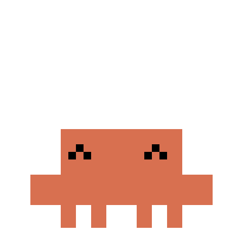
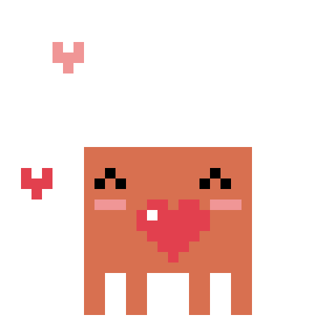
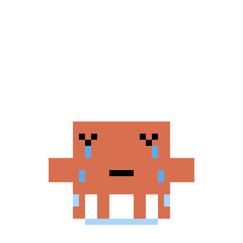
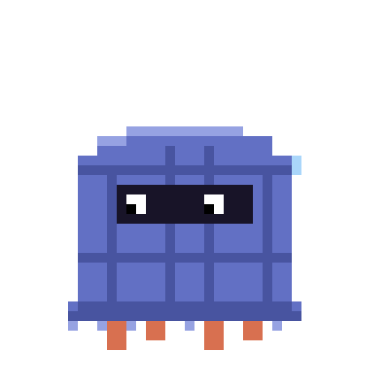
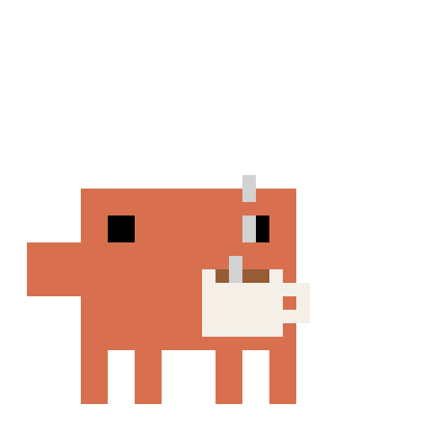
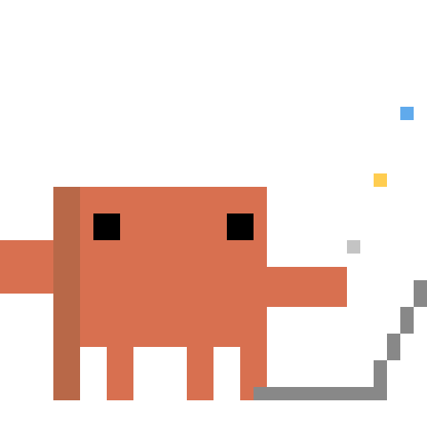
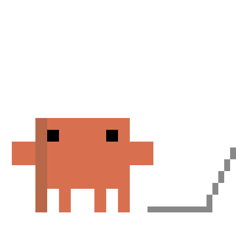

# Крабик — анимированный пак

10 зацикленных пиксельных анимаций без фона.

| | | | | |
|:-:|:-:|:-:|:-:|:-:|
|  hello |  happy |  heart |  cry |  angry |
|  scared |  tea |  laptop |  watch-code |  rage-laptop |

- `gif/` — 480×480, прозрачный фон
- `emoji/` — 100×100 WEBM (VP9 с альфой) для кастомных эмодзи Telegram
- `stickers/` — 512×512 WEBM для видеостикеров Telegram

Все файлы ≤ 3 с и 12.5 fps — в лимитах Telegram.

## Как сделать эмодзи-пак в Telegram

1. Открой [@Stickers](https://t.me/Stickers) → `/newemojipack` → тип **Video emoji**.
2. Придумай название пака.
3. По одному отправляй файлы из `emoji/` **как файл** (не как видео),
   после каждого — обычный эмодзи, к которому он привязан (например 😡 к `angry.webm`).
4. `/publish` → иконка пака (можно пропустить `/skip`) → короткое имя для ссылки `t.me/addemoji/<имя>`.

Видеостикеры — так же, только `/newvideo` и файлы из `stickers/`.
Пользоваться кастомными эмодзи в сообщениях может только Telegram Premium,
создать пак может кто угодно.

## Пересобрать

```
pip install pillow   # и ffmpeg с libvpx-vp9
python3 make_crabs.py
```

Каждая анимация — функция `anim_*` в `make_crabs.py`, кадры рисуются прямоугольниками на сетке 40×40.
